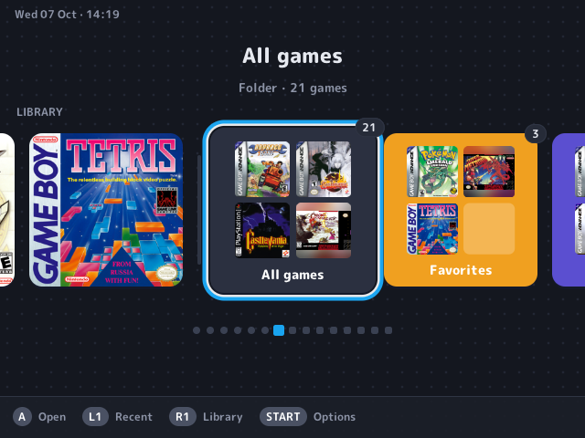

# Shelf

A DSi/3DS-style home screen for the Miyoo Mini and Mini Plus, running on top of
[Onion OS](https://github.com/OnionUI/Onion). Your games as square icons; press A to play.

| Home | Folder | Dark mode |
|---|---|---|
|  |  |  |

## What it does

- **Home row:** recent games, then folders for All games, Favorites and each console, with
  springy DS-style scrolling.
- **Folders:** a grid beside a detail panel showing the selected game's art, play time
  (from Onion's play activity), last played and favorite. Y cycles the sort.
- **Plays through Onion:** games launch via Onion's runtime, so saves, play time and the
  game switcher work as usual, and every game returns to Shelf.
- **Replaces Onion's menu (optional):** boot straight into Shelf. Hold SELECT at boot, or
  use Options, to get stock Onion back. No Onion files are modified.
- **Status bar, sound, dark mode:** clock, Wi-Fi and battery; the Onion theme's click sound;
  a dark palette under START → Options.
- Uses your existing box art and Onion's recents and favorites files.

Status: early. MENU always opens Onion's menu.

## Controls

D-pad moves · A play/open · B back · Y sort · L1/R1 jump · START options · MENU Onion's menu

## Install

```sh
make mm                            # build for the device (podman or docker)
MM_HOST=<device-ip> make push      # copy to App/Shelf over SSH (enable SSH in Onion's Tweaks)
MM_HOST=<device-ip> make boot-on   # optional: boot into Shelf (make boot-off undoes it)
```

Without SSH, copy `build/mm/shelf`, `assets/app/*` and `assets/fonts/` to `App/Shelf/` on
the SD card, then open **Apps → Shelf**.

## Develop

Needs SDL2 (`brew install sdl2`).

```sh
make run     # simulator against a sample SD card in fixture/
make test    # library, UI cache and graphics tests
make shots   # headless screenshots into docs/screenshots
```

Simulator keys: arrows, `Z` = A, `X` = B, `S` = Y, `Q`/`W` = L1/R1, `O` = START, `M` = MENU.

Everything is plain C with a software renderer: `src/ui.c` (screens), `src/library.c` (reads
Onion's SD card), `src/icons.c` (art cache), `src/platform_*.c` (device vs simulator).

## Credits

[Onion OS](https://github.com/OnionUI/Onion), [Allium](https://github.com/goweiwen/Allium)
for the simulator-first idea, [stb](https://github.com/nothings/stb),
[cJSON](https://github.com/DaveGamble/cJSON) (MIT), M PLUS Rounded 1c (SIL OFL 1.1,
`assets/fonts/OFL.txt`), sample box art from
[libretro-thumbnails](https://github.com/libretro-thumbnails).

MIT licensed (see `LICENSE`); bundled code and fonts keep their own licenses.
