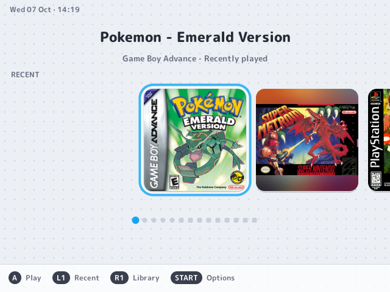
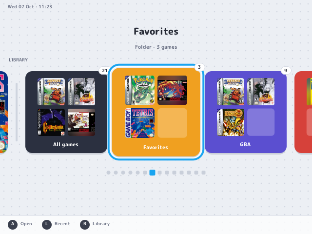
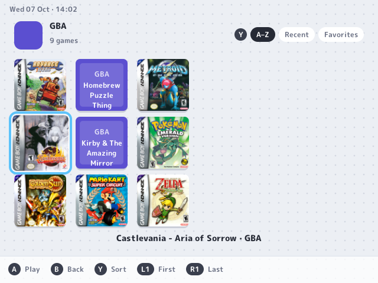

# Shelf

A DSi/3DS-style home screen for the Miyoo Mini and Mini Plus that runs on top of
[Onion OS](https://github.com/OnionUI/Onion). See your games as square icons, press A to play.

| Home | Library | Folder |
|---|---|---|
|  |  |  |

- **Home row:** recent games first, then library folders (All games, Favorites, one per
  console) at the end of the same row, with springy DS-style scrolling.
- **Folders:** a 3-row grid that scrolls sideways. Y cycles the sort (A–Z, Recent, Favorites).
- **Icons:** your existing box art in padded square frames, cached on the SD card.
- **Sound:** navigation clicks use the active Onion theme's `change.wav`.

**Status:** early. Shelf runs as an Onion app, or can replace Onion's menu so the device
boots into it and every game returns to it (see [Boot into Shelf](#boot-into-shelf)).

## Controls

| Button | Home | Folder |
|---|---|---|
| D-pad | move | move |
| A | play / open folder | play |
| B | | back |
| Y | | change sort |
| L1 / R1 | jump to Recent / Library | first / last game |
| MENU | Onion's menu | Onion's menu |

## Install

1. Build the device binary (needs podman or docker; uses Onion's toolchain image):

   ```sh
   make mm
   ```

2. Copy it to the SD card as `App/Shelf/`:

   ```
   App/Shelf/shelf          build/mm/shelf
   App/Shelf/launch.sh      assets/app/launch.sh
   App/Shelf/config.json    assets/app/config.json
   App/Shelf/fonts/         assets/fonts/*.ttf
   App/Shelf/boot.sh        assets/app/boot.sh
   App/Shelf/mainui.sh      assets/app/mainui.sh
   ```

   Or over Wi-Fi with Onion's SSH enabled: `MM_HOST=<device-ip> make push`.

3. On the device open **Apps → Shelf**. `MM_HOST=<device-ip> make log` shows the last log.

### Boot into Shelf

`MM_HOST=<device-ip> make boot-on` (or `sh /mnt/SDCARD/App/Shelf/boot.sh enable` on the
device) makes Shelf the menu Onion starts at boot and returns to after every game.
MENU in Shelf opens Onion's own menu; whatever you start from there also comes back to Shelf.

- **Skip once:** hold SELECT while powering on to get stock Onion for that boot.
- **Undo:** `make boot-off` (`boot.sh disable`), or delete
  `.tmp_update/startup/shelf.sh` (or the whole `App/Shelf`) from the SD card on a computer.

No Onion file is modified. At boot, `startup/shelf.sh` bind-mounts a small stub over
`miyoo/app/MainUI`, named like the `MainUI-<model>-<mode>` binary Onion would mount there, so
Onion's runtime keeps it. The stub starts `mainui.sh`, which runs Shelf and falls back to
Onion's menu if Shelf exits without a game or fails. The mount doesn't survive a reboot. If you
switch Onion's expert/clean mode, Onion mounts its own menu again until the next boot.

## How it fits into Onion

Shelf is a separate app, not a fork. It only uses Onion's files:

| Onion piece | How Shelf uses it |
|---|---|
| `Emu/<SYS>/config.json` | consoles, ROM folder, file extensions, launch script |
| `Roms/<SYS>/Imgs/<rom>.png` | box art (Onion's scraper output); Shelf never downloads art |
| `Roms/recentlist.json`, `recentlist-hidden.json`, `favourite.json` | recents and favorites, written in MainUI's format |
| `.tmp_update/cmd_to_run.sh` | the game command, in MainUI's exact layout |
| `.tmp_update/startup/` | optional boot hook that puts Shelf in MainUI's place |

When you pick a game, Shelf writes the command and exits. `launch.sh` swaps it in as
Onion's next command (by rename, since Onion's shell is still reading the old one) and
sets `/tmp/quick_switch`. Onion's runtime then launches the game as if MainUI had,
with saves, play time and the game switcher working as usual.

## Artwork

Shelf shows whatever is in Onion's `Imgs` folders; scrape with Onion's scraper as usual.
Games without art get a coloured placeholder tile.

For games the scraper misses, `tools/fetch_artwork.py` downloads art you list explicitly
in a JSON manifest. Each entry names the target `path` plus either a Libretro thumbnail
(`repo` and `title`) or a direct `url` for things Libretro doesn't have, like homebrew.
It never touches ROMs or replaces existing art. See `tools/artwork-example.json`.

```sh
python3 tools/fetch_artwork.py my-artwork.json /path/to/SDCARD
```

## Develop on a computer

Needs SDL2 (`brew install sdl2`).

```sh
make run      # build the simulator and a sample SD card in fixture/, open a 640x480 window
make test     # library discovery, UI cache behaviour, pixel-exact graphics primitives
make shots    # headless screenshots into docs/screenshots
```

Simulator keys: arrows · `Z`/`Space`/`Enter` = A · `X`/`Backspace` = B · `S`/`Y` = Y ·
`Q`/`W` = L1/R1 · `M` = MENU · `Esc` quits. `SHELF_SCALE=3 make run` enlarges the window.
Point it at a copy of a real card with
`SHELF_ROOT=/Volumes/SDCARD SHELF_FONTS=$PWD/assets/fonts SHELF_CMD=/tmp/cmd.sh build/shelf-sim`.

Rendering is software-only into a 640x480 buffer. Tiles are cached sprites whose opaque
rows are copied rather than blended; the settled scene is retained, so idle frames only
redraw the cursor. Box art decodes on a background thread. On the device,
`SHELF_BENCH=600 SHELF_BENCH_SCENE=scroll ./shelf` measures rendering without taking over
the screen (scenes: `home`, `scroll`, `grid`, `transition`).

ROM discovery follows each system's `extlist`, includes category subfolders (skipping
hidden folders, `Imgs` and symlinks) and lists M3U/CUE entries instead of their discs.

## Layout

```
src/main.c           main loop, headless screenshots, benchmarks
src/ui.c             home row, folder grid, springs, launch animation
src/library.c        Onion SD card reader, launch command and recents writer
src/icons.c          art tiles, SD cache, background loader
src/gfx.c, text.c    software canvas, stb_truetype text
src/platform_mm.c    Miyoo: SDL 1.2 display (180° panel), buttons, click sound
src/platform_sdl2.c  simulator window and keyboard
assets/app/          Onion app files (launch.sh, config.json) and the boot hook (boot.sh, mainui.sh)
tools/               fixture builder, tests, device helper, artwork and font scripts
```

## Credits

- [Onion OS](https://github.com/OnionUI/Onion), and [Allium](https://github.com/goweiwen/Allium) for the simulator-first idea
- [stb_image, stb_truetype](https://github.com/nothings/stb) (public domain / MIT)
- [cJSON](https://github.com/DaveGamble/cJSON) (MIT, `third_party/cJSON.LICENSE`)
- M PLUS Rounded 1c, © 2016 The Rounded M+ Project Authors, SIL Open Font License 1.1
  (`assets/fonts/OFL.txt`)
- Sample box art in the screenshots from [libretro-thumbnails](https://github.com/libretro-thumbnails)

## License

Shelf is MIT licensed (see `LICENSE`). Bundled third-party code and fonts keep their own
licenses, listed under Credits.
